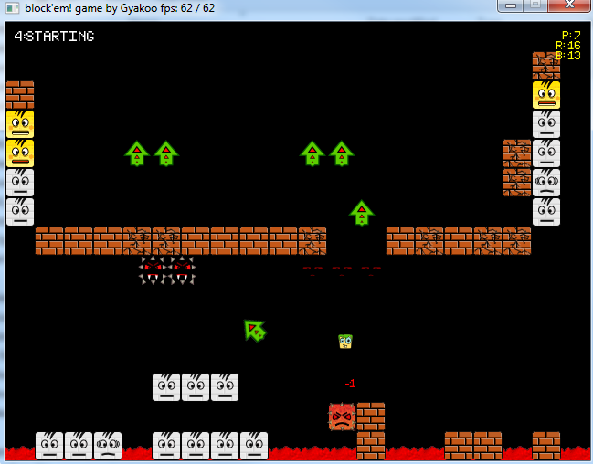

# blockem
Simple game created for testing Python/PyGame
You have to clear the level by flying with your little friend and touching white block to turn them into yellow ones. 
Be careful, once they're yellow if you touch them again, they'll turn in angry red ones. 
Difficulty hasn't been adjusted so you'll expect very hard levels.

# How to play
Use the ARROW Keys to move the little green friend. 
Press F4/F5 to cycle through available levels. 

# Build
You need python2.7 + Pygame 
py2exe was used to generate the .exe 